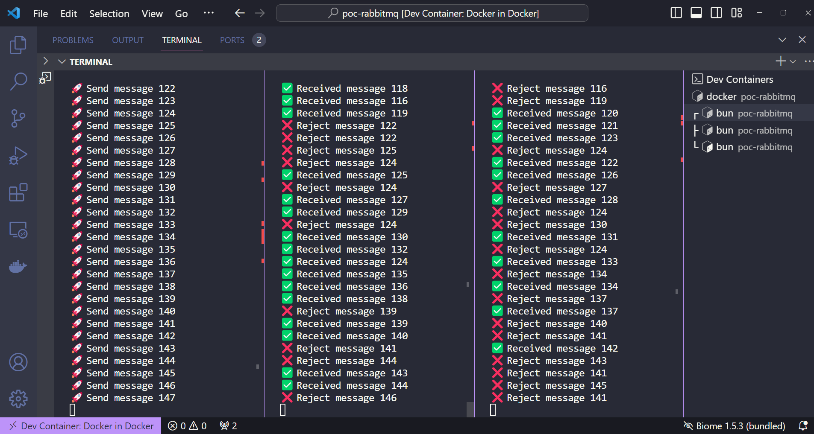

# POC RabbitMQ + Bun

Este é um projeto didatico que utiliza RabbitMQ para explorar na prática o conceito de Pub/Sub (produtor/consumidor), além de testar a integração com a biblioteca Bun.



## Como Iniciar

1. Inicie o servidor RabbitMQ:
   ```bash
   $ docker compose up
   ```

2. Acesse o painel administrativo:
   Abra o navegador e visite [http://localhost:15672](http://localhost:15672)

3. Instale as Dependências:
   ```bash
   $ bun install
   ```

4. Inicie o Produtor:
   ```bash
   $ bun producer.ts
   ```

5. Inicie o Consumidor:
   Execute o comando abaixo várias vezes para visualizar o conceito de fila.
   ```bash
   $ bun consumer.ts
   ```
